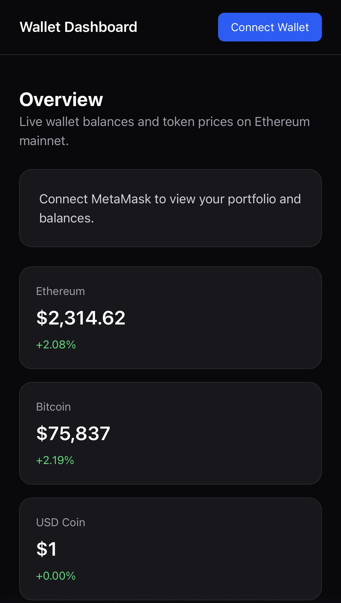

# Wallet Dashboard

[](PASTE_YOUR_VERCEL_URL_HERE)


A responsive Web3 wallet dashboard built with React and TypeScript. Users can connect MetaMask, view live ETH and token balances on Ethereum mainnet, see token prices and 24-hour price changes, and check total portfolio value in USD.

## Live Demo
[Open the app](PASTE_YOUR_VERCEL_URL_HERE)

## Screenshot


## Features
- Connect wallet with MetaMask
- Show connected wallet address
- Show Ethereum mainnet network badge
- Show ETH, USDC, and USDT balances
- Show total portfolio value in USD
- Show live ETH, BTC, and USDC prices
- Show 24h price change
- Responsive mobile-friendly layout
- Loading skeleton states and clean empty states

## Tech Stack
- React
- TypeScript
- Vite
- wagmi
- viem
- TanStack Query
- Tailwind CSS
- Vercel

## Local Setup
```bash
npm install
npm run dev
```
